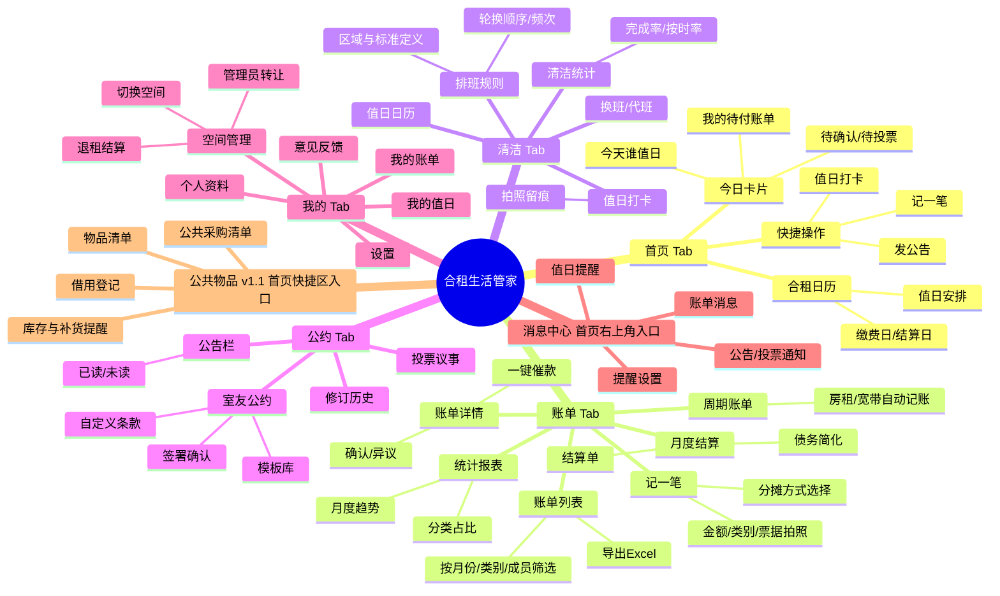
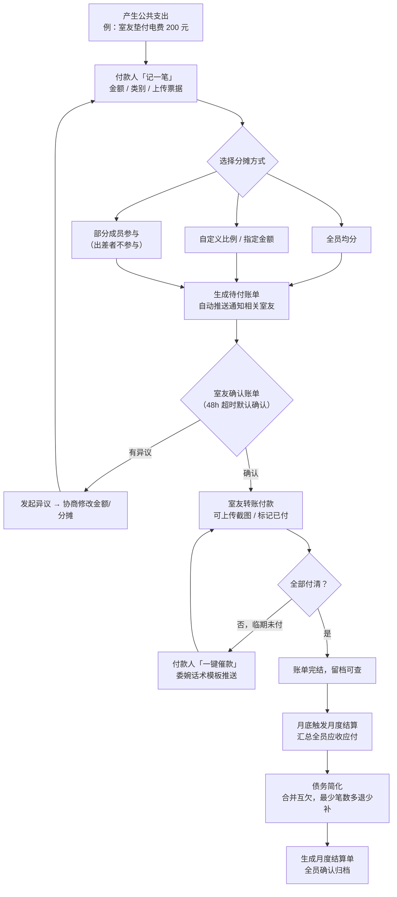
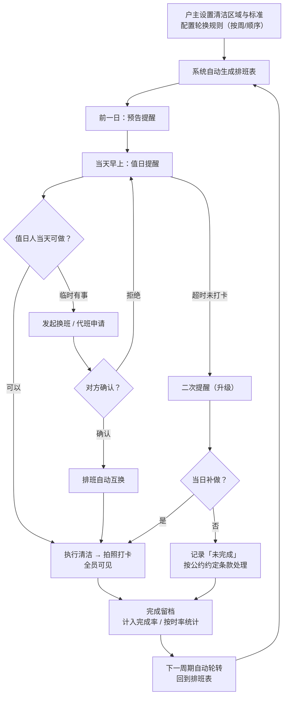
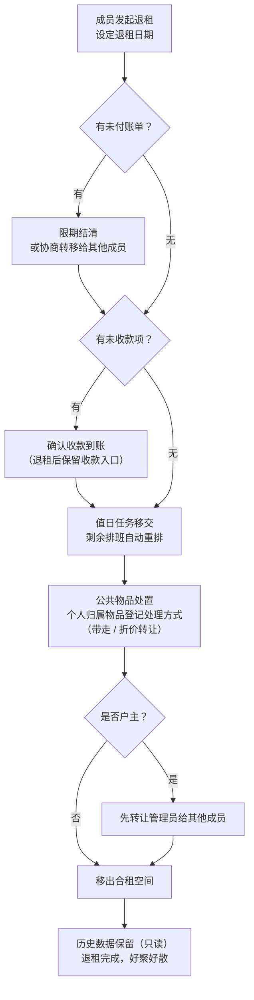
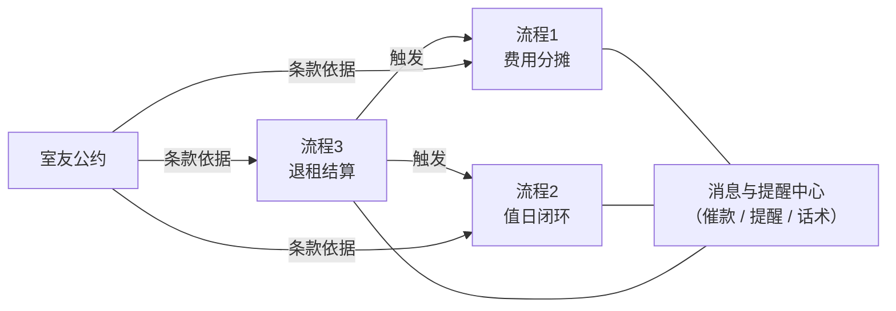

# 合租生活管家 · 信息架构与业务流程图 v1.0

> 文档日期：2026-09-12
> 配套文档：《合租生活管家-功能清单-v1.0》
> 本文图表均为 Mermaid 源码，可在支持 Mermaid 的工具（Typora / Obsidian / VS Code / mermaid.live）中直接渲染编辑；也可打开同目录 HTML 文件查看渲染效果。

---

## 一、产品信息架构图（IA）

### 1.1 整体结构

### 1.2 导航结构说明

| 层级 | 内容 | 说明 |
|------|------|------|
| 底部 Tab（5 个） | 首页 / 账单 / 清洁 / 公约 / 我的 | 对应四大核心场景 + 个人中心 |
| 首页右上角 | 消息中心（带未读红点） | 全量通知聚合，贯穿各模块 |
| 首页快捷区 | 记一笔、值日打卡、发公告 + 公共物品（v1.1） | 高频操作一步直达 |
| 二级页面 | 由各 Tab 列表页进入详情/设置页 | 遵循"列表 → 详情 → 操作"三层深度 |

**设计要点**
- MVP 阶段"首页"可简化为"今日卡片 + 快捷操作"，日历视图 P1 再补
- "记一笔"是全局最高频操作，除首页快捷区外，账单 Tab 内常驻悬浮按钮
- 消息中心不做成 Tab：它是被动触达入口，做成 Tab 会稀释底部导航的场景心智

---

## 二、业务流程图 1：费用 AA 分摊流程

> 核心目标：从"垫付"到"结清"全程留痕，App 代替人开口催款。

**关键节点说明**

| 节点 | 设计意图 |
|------|----------|
| 分摊方式三选一 | 覆盖"绝对公平（均分）"与"相对公平（按比例/出差豁免）"两类心智 |
| 超时默认确认 | 防止"装死不确认"导致账单卡死，保证流程可推进 |
| 一键催款话术 | 产品的情绪价值核心：委婉、留面子、有据可查 |
| 债务简化 | 3 人以上合租互欠常见，合并后每人最多转一次账 |

---

## 三、业务流程图 2：清洁值日闭环

> 核心目标：排班自动化 + 执行留痕 + 异常有处理通道，杜绝"说了等于没说"。

**关键节点说明**

| 节点 | 设计意图 |
|------|----------|
| 两次提醒 + 升级 | 预告 → 当天 → 超时升级，节奏递进而非一次性打扰 |
| 换班需对方确认 | 权责转移必须双方知情，避免"我以为你帮我做了" |
| 拍照打卡全员可见 | 留痕 + 被看见，付出可视化本身就是激励 |
| 未完成关联公约 | 惩罚规则不内置在 App，而是引用自家公约，App 只做记录者 |

---

## 四、业务流程图 3：退租结算流程

> 核心目标：好聚好散——钱清、事交、权转、数据留。

**关键节点说明**

| 节点 | 设计意图 |
|------|----------|
| 未收款项保留入口 | 退租后人走了但钱没收回是最高频纠纷，流程上必须兜底 |
| 值日自动重排 | 避免人走了排班表出现"幽灵岗" |
| 物品处置登记 | "那个锅是谁的"是退租经典争吵点，提前在流程里消化 |
| 户主先转让再退出 | 防止空间失管，保证留下的人能继续用 |
| 数据只读保留 | 退租者可回查历史账单，防止后续扯皮无据 |

---

## 五、三条流程的联动关系

- **消息中心是横向支撑**：三条流程的"催"与"提醒"全部经由它统一发出
- **公约是规则底座**：费用规则、值日规则、退租约定都在流程节点中被引用
- **退租是汇聚点**：触发账单清算、值日重排、物品处置、权限转移四个子动作
